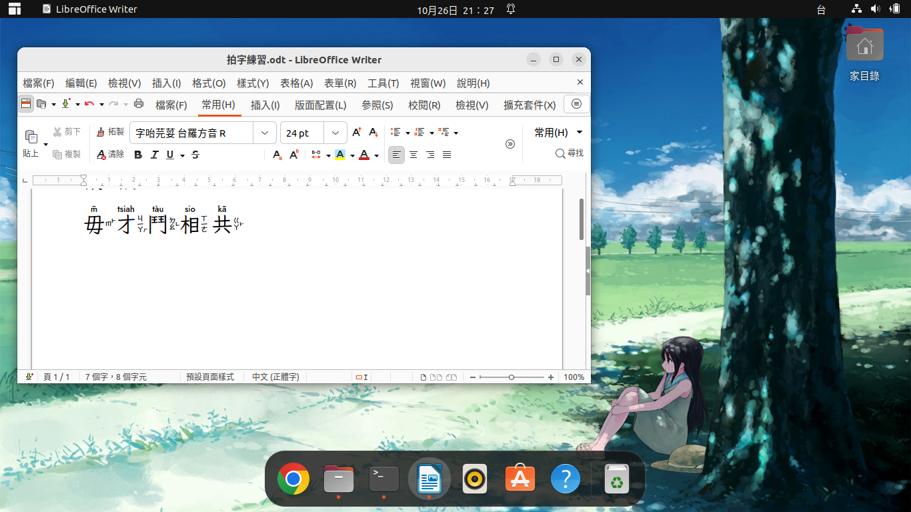

# 專案摘要

為以下高手們無私的貢獻，致上十二萬分的感謝！

- [a-thok/rime-hokkien](https://github.com/a-thok/rime-hokkien)；

- [glll4678/rime-taigi](https://github.com/glll4678/rime-taigi)。

此處所使用的輸入法，是於 RIME 輸入法平台發展而成，漢字的發音，採用
「臺羅拼音」。專案的目的，不在於發展台語輸入法；而是收集祖先所使用
的漢字。向望祖先智慧的遺產，會使留傳世代萬年，永不斷絕！

## 安裝

1. 安裝 [RIME](http://rime.im) ； 

2. 下載 [rime-taigi](https://github.com/AlanJui/rime-taigi/releases)
   壓縮包檔案；

3. RIME 設定檔所在目錄路徑（或稱：資料夾），在不同的作業系統，各有不同：    

    - 鼠鬚管：`~/Library/Rime/`(macOS)  

    - 小狼毫：`"%APPDATA%\Rime"`(Windows)

    - 中州韻：`~/.config/ibus/rime/`(如：Ubuntu, ArchLinux，採用 Gnome 桌面＋ ibus 輸入作業平台)

4. 將作業系統使用中的輸入法，先切換成 RIME，再執行 RIME
   輸入法中的「重新部署」指令。

## 字形

以下建議使用之字形，均為開源、免費字形：

- [思源黑體](https://github.com/adobe-fonts/source-han-sans)

- [Noto Sans Traditional Chinese](https://fonts.google.com/noto/specimen/Noto+Sans+TC)

- [字咍](https://github.com/ButTaiwan/taigivs/releases)

- [豆腐烏](https://github.com/glll4678/tshiuthau)

- [Fira Sans](https://github.com/mozilla/Fira)

